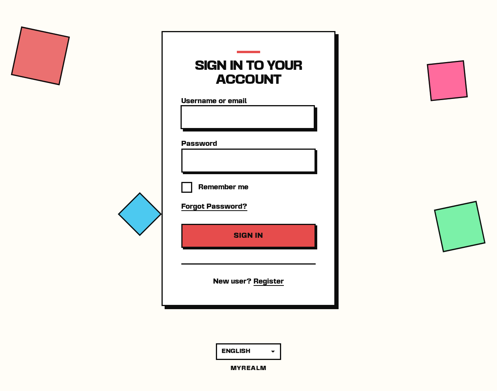
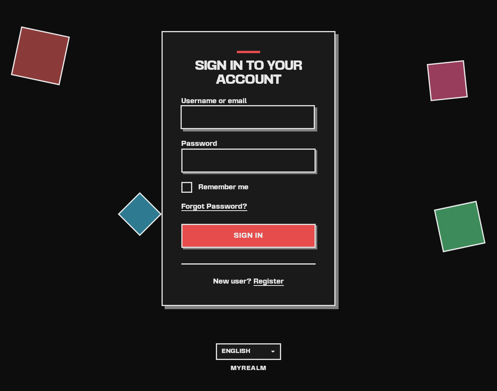
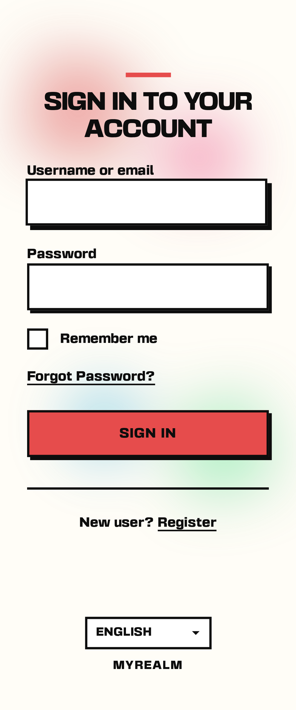
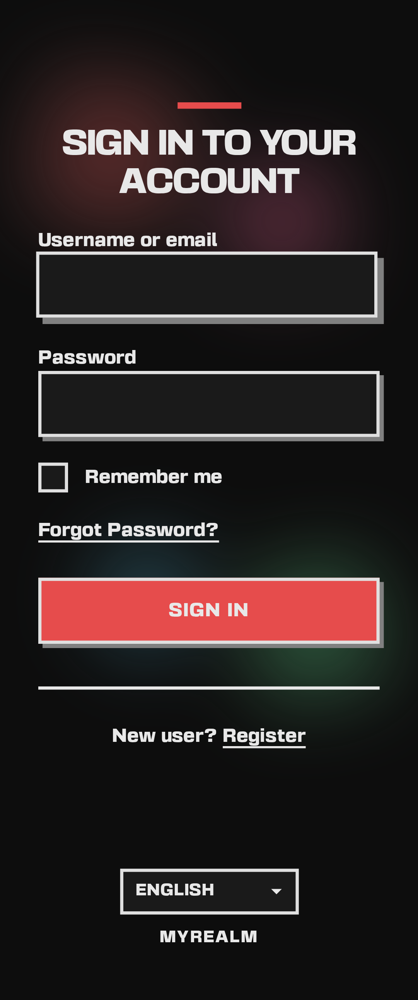

# Spinel

A neo-brutalist Keycloak theme with automatic dark mode support.

**[Live Demo](https://for-keycloak.github.io/spinel-theme/)** - Browse all themed pages in Storybook


## Features

- **Neo-Brutalist Design** - Bold typography, sharp geometric shapes, heavy 3px borders with offset shadows
- **Automatic Dark Mode** - Theme switches based on system preference
- **Fully Responsive** - Optimized for desktop, tablet, and mobile
- **Complete Theme Coverage** - Login and Email themes included
- **Built with Keycloakify v11** - React-based theming with Tailwind CSS v4

## Screenshots

### Desktop

| Light Mode | Dark Mode |
|------------|-----------|
|  |  |

### Mobile

| Light Mode | Dark Mode |
|------------|-----------|
|  |  |

## Installation

### Option 1: Download JAR

Download the latest JAR from [Releases](../../releases):

<!-- x-release-please-start-version -->
- `spinel-theme-v1.0.1-22-to-25.jar` - For Keycloak 22-25
- `spinel-theme-v1.0.1-all-other-versions.jar` - For Keycloak 26+
<!-- x-release-please-end -->

### Option 2: Build from Source

```bash
git clone https://github.com/for-keycloak/spinel-theme.git
cd spinel-theme
yarn install
yarn build-keycloak-theme
```

The JAR files will be in the `dist_keycloak/` directory.

### Deploy to Keycloak

Copy the JAR to your Keycloak's `providers` directory:

```bash
cp spinel-*.jar /opt/keycloak/providers/
```

Restart Keycloak, then:

1. Go to **Keycloak Admin Console**
2. Select your realm
3. Navigate to **Realm Settings** → **Themes**
4. Set **Login theme** to **spinel**
5. (Optional) Set **Email theme** to **spinel**
6. Save

## Customization

### Colors

Edit the CSS variables in `src/index.css`:

```css
@theme {
  --color-cream: #FFFDF7;  /* Background */
  --color-accent: #E64C4C; /* Primary accent (red) */
  --color-black: #0D0D0D;  /* Text & borders */
  --color-white: #FFFFFF;  /* Card background */
}
```

Dark mode colors are in the `@media (prefers-color-scheme: dark)` block.

### Theme Name

To create your own branded version, change the theme name in `vite.config.ts`:

```typescript
keycloakify({
  themeName: "your-theme-name",
})
```

## Development

### Prerequisites

- Docker & Docker Compose
- [Just](https://github.com/casey/just) command runner

### Commands

```bash
# Install dependencies
just install

# Start Storybook for development
just up

# Open shell in container
just shell

# Build the theme JAR
just build

# Run tests
just test
```

### Project Structure

```
src/
├── login/              # Login theme (React)
│   ├── KcPage.tsx      # Page router
│   ├── Template.tsx    # Main template
│   └── pages/          # Custom pages
├── email/              # Email theme (FreeMarker)
│   └── theme.properties
└── index.css           # Neo-brutalist styles
```

## Supported Pages

All standard Keycloak login pages are styled:

- Login (username/password)
- Register
- Forgot/Reset Password
- Update Password
- Email Verification
- OTP/2FA Setup & Login
- Recovery Codes
- Passkey Setup & Login
- OAuth Consent
- Update Profile
- And more...

## Tech Stack

- [Keycloakify](https://keycloakify.dev) v11 - React-based Keycloak theming
- [Tailwind CSS](https://tailwindcss.com) v4 - Utility-first CSS
- [Vite](https://vitejs.dev) - Build tool
- [Storybook](https://storybook.js.org) - Component development

## License

This project is released into the public domain under the [UNLICENSE](./UNLICENSE).

### Font License

This theme uses [Basement Grotesque](https://github.com/basementstudio/basement-grotesque) font, licensed under the [SIL Open Font License 1.1](./LICENSES/OFL-1.1-BasementGrotesque.txt).
